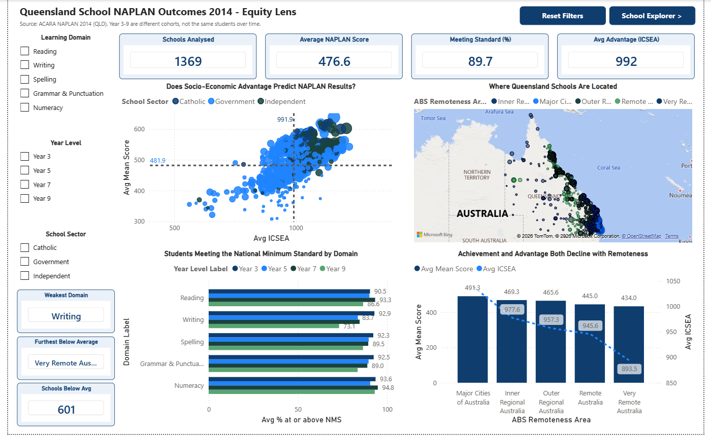
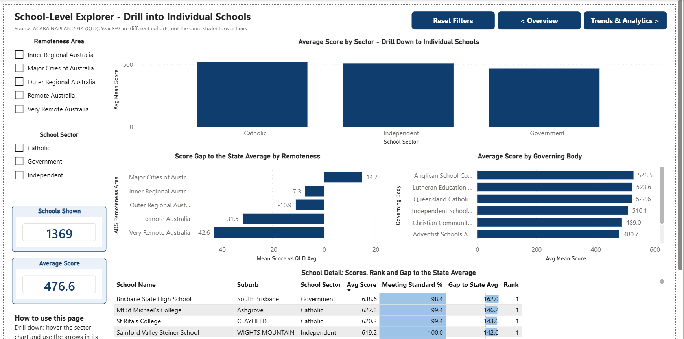
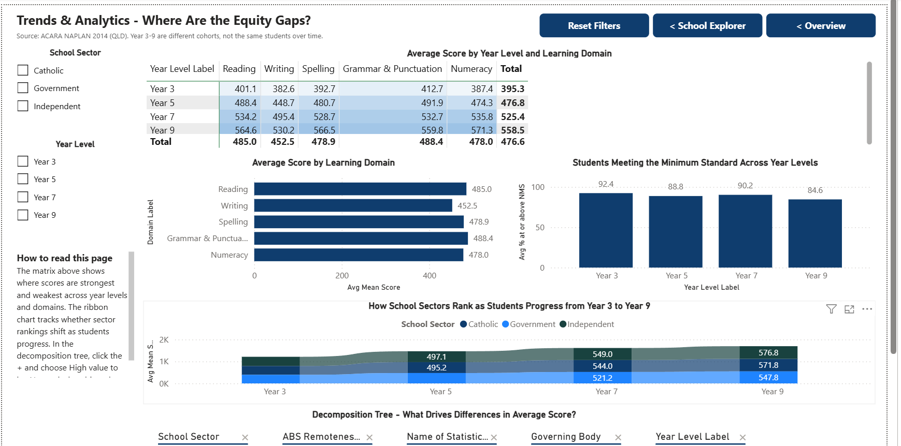
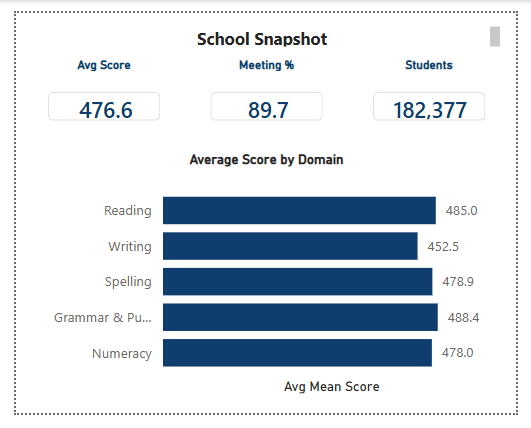

<h1 align="center">📊 NAPLAN 2014 Queensland — Power BI Equity Dashboard</h1>

<p align="center">
  <em>Where are the equity gaps in Queensland schooling, and which schools and regions need support?</em>
</p>

<p align="center">
  
  
  
  
</p>

<p align="center">
  
  
  
  
</p>

---

## 👤 About

| | |
|---|---|
| 🎓 **Author** | B M Nahid Hasan Adnan |
| 🆔 **Student ID** | 15067067 |
| 📚 **Subject** | MA5830 – Data Visualisation, James Cook University |
| 📝 **Assessment** | Assessment 4 — Dashboard Visualisation Plan |
| 📅 **Submitted** | 15 August 2026 |

---

## 🎯 Overview

An interactive Power BI dashboard exploring **educational equity** across Queensland
schools using the ACARA NAPLAN 2014 dataset.

It is built for education-equity analysts, regional officers and school principals —
numerate professionals who read charts to support funding submissions and
intervention decisions, **not** to conduct statistical inference. They are time-poor,
so every insight has to be legible at a glance and defensible when quoted in a briefing.

> 💡 **Design spine:** Shneiderman's visual information-seeking mantra —
> *overview first, zoom and filter, then details on demand* — mapped one stage per page.

---

## 🗂️ The three pages

| | Page | 🎬 Role | 📈 Key visuals |
|:--:|------|---------|----------------|
| 1️⃣ | **Overview** | State-wide position | 6 KPI cards · ICSEA-vs-score scatter · school location map |
| 2️⃣ | **School Explorer** | Filter and drill to individual schools | Sector → school drill-down · gap-to-average bar · governing-body bar · sector donut |
| 3️⃣ | **Trends & Analytics** | Analytical / AI-driven investigation | Year-level × domain matrix · domain & minimum-standard columns · sector ribbon · decomposition tree |
| 🔍 | *School Snapshot* <sub>(hidden tooltip)</sub> | Details on demand | Per-school score · % meeting standard · students tested · domain mini-bar |

### 1️⃣ Overview — the state-wide position

<p align="center">
  
</p>

### 2️⃣ School Explorer — drill into individual schools

<p align="center">
  
</p>


### 3️⃣ Trends & Analytics — where are the equity gaps?

<p align="center">
  
</p>

### 🔍 School Snapshot — the report-page tooltip

<p align="center">
  
</p>

---

## 📁 Data sources

Three supplied ACARA files for Queensland schools (2014):

| 📄 File | 📋 Contents |
|---------|-------------|
| `school_stats_naplan_2014_Queensland.xlsx` | NAPLAN results — scores and % meeting standard |
| `school_profile_2014_Queensland.xlsx` | School profiles — ICSEA, governing body |
| `school_locations_2014_Queensland.xlsx` | Geographic and statistical-area locations |

### 🔗 Data model

A **star schema** built in Power Query:

```
┌──────────────────────────────┐         ┌─────────────────────────────┐
│   📊 FACT — NAPLAN results   │  ──▶    │  🏫 DIM — School dimension  │
│   60,236 rows (unpivoted)    │  many   │  1,865 rows                 │
│   Attribute → Value          │  to one │  Sector · Remoteness ·      │
│   Year Level · Domain ·      │         │  Lat/Long · ICSEA ·         │
│   Measure Type               │         │  Governing Body             │
└──────────────────────────────┘         └─────────────────────────────┘
              └────────── ACARA SML ID ──────────┘
                  single-direction cross-filter
```

<details>
<summary>🧮 <strong>Key DAX measures</strong> (click to expand)</summary>

<br>

| Measure | Definition |
|---------|------------|
| `Avg Mean Score` | AVERAGE of Value on Mean-Score rows |
| `Avg % at or above NMS` | AVERAGE of Value on Percent-NMS rows |
| `Students Tested` | SUM of enrolment rows, `REMOVEFILTERS` on Domain |
| `School Count` | `DISTINCTCOUNT` of ACARA SML ID |
| `Avg ICSEA` | AVERAGE of ICSEA |
| `Mean Score vs QLD Avg` | Score − `ALL(School_Locations)` score |
| `School Rank by Mean Score` | `RANKX` over `ALLSELECTED` names, `ISBLANK`-guarded |

</details>

### ⚠️ Data limitations

- 🕳️ **~43.5%** of unpivoted fact-table values are missing once suppression codes
  (`--`, `^`, `*`) are treated as **missing rather than zero** — so an unreported
  school is never shown as a poor performer. Averages use reported values only.
- 📉 Coverage thins across year levels: **399** schools at Year 9 vs **904** at Year 3,
  so cross-year comparisons involve different school populations.
- 🔢 ICSEA exists for **1,298** of the 1,369 analysable schools — the scatter omits 71.
- ⏳ 2014 is a **single year**. Year 3 → Year 9 is a developmental progression across
  concurrent cohorts, *not* one cohort tracked over six years.

---

## 🎨 Design notes

| | Principle | Applied as |
|:--:|-----------|------------|
| 📏 | **Encoding accuracy** | Cleveland–McGill ranking — position and length carry quantities judged precisely; colour hue and area carry only secondary information |
| ♿ | **Accessibility** | *AccessibleTidal* theme; red–green avoided as the primary categorical distinction |
| 🎨 | **Restrained chrome** | One navy `#0F3D6E` with pale blue `#EAF1F8` accents, so saturated colour appears only where it encodes data |
| 🖱️ | **Interaction policy** | Three tiers — **suppress** where a selection would destroy a baseline (12 interactions), **filter** where it should narrow the population (2), Power BI **default highlighting** elsewhere |
| 🧭 | **Consistency** | Persistent left filter rail, navigation cluster fixed top-right, coarse-to-fine down the page |

<p align="center">
  <code>#0F3D6E</code> navy &nbsp;·&nbsp; <code>#EAF1F8</code> pale blue
</p>

📖 **References:** Shneiderman (1996) · Munzner (2014) · Cleveland & McGill (1984) ·
Yi et al. (2007) · Tufte (2001) · Few (2013) · Knaflic (2015)

---

## 🗃️ Repository structure

```
📦 naplan-qld-equity-dashboard
├── 📄 README.md
├── 🚫 .gitignore
├── 📊 Hasan_Adnan_BMNahid_MA5830_A4.pbix           ← the dashboard — open in Power BI Desktop
├── 📈 school_stats_naplan_2014_Queensland.xlsx     ← NAPLAN results
├── 🏫 school_profile_2014_Queensland.xlsx          ← ICSEA, governing body
├── 📍 school_locations_2014_Queensland.xlsx        ← geography, remoteness
├── 📚 Adnan_BMNahidHasan_MA5830_A4.pdf             ← dashboard visualisation plan
├── 📋 Assessemtn_4_NAPLAN_File_Descriptions.pdf    ← source file descriptions
└── 🖼️ images/                                      ← dashboard screenshots used above
```

---

## 🚀 How to open

| Step | Action |
|:----:|--------|
| 1️⃣ | Install [**Power BI Desktop**](https://powerbi.microsoft.com/desktop/) (Windows) |
| 2️⃣ | Clone or download this repository |
| 3️⃣ | Open `Hasan_Adnan_BMNahid_MA5830_A4.pbix` |
| 4️⃣ | If prompted to refresh, point the data sources at the three `.xlsx` files in the repo root |

```bash
git clone https://github.com/nahid-adnan/naplan-qld-equity-dashboard.git
```

---

## ⚖️ Data attribution & licence

📌 NAPLAN data © **Australian Curriculum, Assessment and Reporting Authority (ACARA)**.
Provided here for coursework — please check ACARA's terms of use before redistributing.

🎓 The dashboard, data model and documentation are the author's own academic work.

<p align="center">
  <sub>Built with Power BI · Power Query · DAX &nbsp;|&nbsp; MA5830 Data Visualisation, JCU</sub>
</p>
